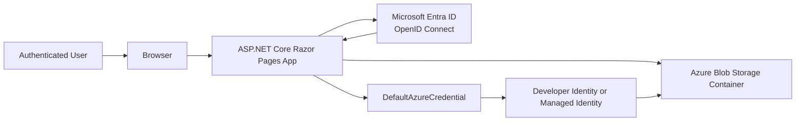
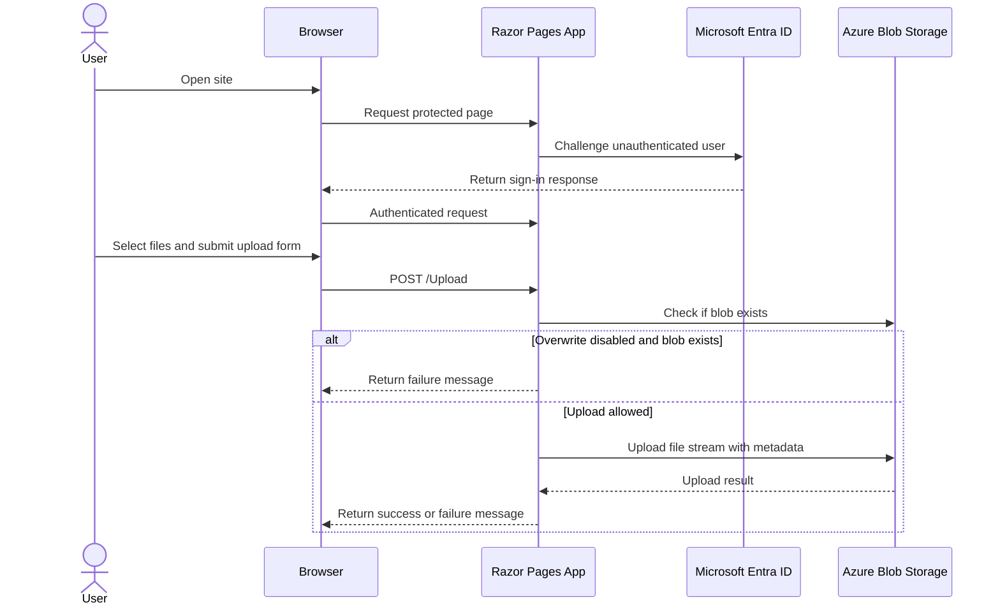

# Azure File Upload .NET Web App

This project is an ASP.NET Core Razor Pages application that requires Microsoft Entra ID sign-in and uploads files to Azure Blob Storage.

The application uses:

- ASP.NET Core Razor Pages on .NET 8
- OpenID Connect for user authentication
- Azure Blob Storage for file uploads
- DefaultAzureCredential for Azure authentication to Storage

## Features

- Requires users to authenticate before accessing the site
- Uploads one or more files to a configured Blob container
- Optionally overwrites existing blobs
- Writes authenticated user metadata to uploaded blobs when claims are available
- Shows success and failure messages in the UI

## Project Structure

```text
AzureFileUpload-Dotnet-WebApp/
|-- Program.cs
|-- appsettings.json
|-- AzureFileUpload.csproj
|-- Pages/
|   |-- Index.cshtml
|   |-- Upload.cshtml
|   |-- Upload.cshtml.cs
|   |-- Logout.cshtml.cs
|   `-- Shared/
`-- wwwroot/
```

## Prerequisites

Before running the application, install and configure the following:

- .NET 8 SDK
- An Azure subscription
- A Microsoft Entra ID app registration for OpenID Connect sign-in
- An Azure Storage account with a Blob container
- A credential source supported by `DefaultAzureCredential`

For local development, `DefaultAzureCredential` typically works with one of these signed-in options:

- Azure CLI via `az login`
- Visual Studio or Visual Studio Code Azure sign-in
- Environment variables for a service principal

## Azure Configuration

### 1. Create a Microsoft Entra ID app registration

Register a web application in Microsoft Entra ID and capture these values:

- Tenant ID
- Client ID
- Client secret

Add a web redirect URI for local development. With the default ASP.NET Core OpenID Connect handler, use:

```text
https://localhost:7035/signin-oidc
```

If you change the local HTTPS port, update the redirect URI to match.

### 2. Create a Blob container

Create or choose:

- An Azure Storage account
- A Blob container that will receive uploads

### 3. Grant Storage permissions

The identity used by `DefaultAzureCredential` must have permission to upload blobs to the target container.

For local development, assign an appropriate Azure RBAC role to your signed-in identity, typically:

- `Storage Blob Data Contributor`

For deployed hosting, assign the same type of role to the application's managed identity or service principal.

## Application Settings

Update [appsettings.json](./appsettings.json) with your environment values:

```json
{
  "OpenIdConnect": {
    "Authority": "https://login.microsoftonline.com/<tenant-id>/v2.0",
    "ClientId": "<app-registration-client-id>",
    "ClientSecret": "<app-registration-client-secret>"
  },
  "StorageAccount": {
    "Name": "<storage-account-name>",
    "Container": "<blob-container-name>"
  },
  "URLS": "https://localhost:5001;http://localhost:5000"
}
```

Notes:

- `Authority` must include your tenant identifier.
- `StorageAccount:Name` is only the storage account name, not a full URL.
- `StorageAccount:Container` must already exist.
- The app reads Blob credentials from `DefaultAzureCredential`, not from a storage connection string.

## Local Development

### 1. Trust the development certificate

```powershell
dotnet dev-certs https --trust
```

### 2. Restore dependencies

```powershell
dotnet restore
```

### 3. Run the application

```powershell
dotnet run --launch-profile https
```

By default, the launch profile uses:

- `https://localhost:7035`
- `http://localhost:5017`

Open the HTTPS URL in a browser, sign in, and navigate to the Upload page.

## Architecture Overview



This flow reflects the current implementation:

- The web app uses OpenID Connect to sign users in through Microsoft Entra ID.
- The app uses `DefaultAzureCredential` to obtain an Azure identity for Blob Storage access.
- Uploaded files are written directly to a configured Blob container.

## Upload Sequence



## How Uploads Work

When a user uploads files from the Upload page, the application:

1. Validates that at least one file was selected.
2. Connects to the configured Blob container.
3. Checks whether each blob already exists.
4. Skips existing blobs unless the user selected the overwrite option.
5. Uploads the file stream with content type metadata.
6. Adds user-related metadata when available from claims:
   - `userprincipalname`
   - `objectid`

If the signed-in identity lacks storage permissions, the app returns a user-facing authorization message.

## Authentication Behavior

- All Razor Pages require an authenticated user.
- Cookie authentication is used for the local session.
- OpenID Connect is used to challenge unauthenticated users.
- The Logout page signs out both the cookie session and the OpenID Connect session.

## Deployment

This repository does not include Infrastructure as Code, Docker assets, or CI/CD workflows, so deployment is currently a manual process. The most natural hosting options for the existing code are Azure App Service and Azure Container Apps.

### Option 1: Azure App Service

Azure App Service is the simplest fit for the current project because it can host an ASP.NET Core web app directly without containerization.

Typical deployment flow:

1. Create an App Service plan and Web App.
2. Enable a system-assigned managed identity on the Web App.
3. Grant that managed identity `Storage Blob Data Contributor` on the target storage account or container.
4. Add a production redirect URI to the Entra app registration:

```text
https://<your-app-name>.azurewebsites.net/signin-oidc
```

5. Configure application settings in App Service:

```text
OpenIdConnect__Authority=https://login.microsoftonline.com/<tenant-id>/v2.0
OpenIdConnect__ClientId=<app-registration-client-id>
OpenIdConnect__ClientSecret=<app-registration-client-secret>
StorageAccount__Name=<storage-account-name>
StorageAccount__Container=<blob-container-name>
```

6. Publish the application to App Service.

Examples of deployment approaches:

- Visual Studio publish profile
- `dotnet publish` plus Zip Deploy
- GitHub Actions deployment workflow

Manual CLI-oriented example:

```powershell
dotnet publish -c Release -o .\publish
Compress-Archive -Path .\publish\* -DestinationPath .\publish.zip -Force
az webapp deploy --resource-group <resource-group> --name <app-name> --src-path .\publish.zip --type zip
```

### Option 2: Azure Container Apps

Azure Container Apps is a good fit if you want container-based deployment, revision management, and a cleaner path to future background processing or more complex environments.

Because this repository does not currently include a `Dockerfile`, the first step is to add containerization assets.

Typical deployment flow:

1. Add a `Dockerfile` for the ASP.NET Core app.
2. Build and push the image to Azure Container Registry.
3. Create a Container Apps environment and container app.
4. Enable a managed identity for the container app.
5. Grant `Storage Blob Data Contributor` to that identity.
6. Add the production redirect URI to the Entra app registration using your Container Apps ingress URL.
7. Configure the same application settings as environment variables.

Environment variables for Container Apps:

```text
OpenIdConnect__Authority=https://login.microsoftonline.com/<tenant-id>/v2.0
OpenIdConnect__ClientId=<app-registration-client-id>
OpenIdConnect__ClientSecret=<app-registration-client-secret>
StorageAccount__Name=<storage-account-name>
StorageAccount__Container=<blob-container-name>
```

### Production Configuration Notes

- Prefer managed identity for Blob access in Azure hosting.
- Prefer Azure Key Vault or platform secret storage over storing real secrets in source-controlled JSON files.
- Ensure the redirect URI exactly matches the production hostname and `/signin-oidc` path.
- Confirm outbound access from the host to `login.microsoftonline.com` and Azure Blob Storage.
- If you scale out, blob naming conflicts still follow the current overwrite behavior implemented by the Upload page.

## Important Notes

- This repository does not include Infrastructure as Code or deployment automation.
- `appsettings.json` contains placeholder values and should not be committed with real secrets.
- The app currently uses a client secret in configuration for OpenID Connect.
- The app currently depends on external Azure identity context for Blob access.

## Troubleshooting

### No .NET SDK found

If `dotnet build` or `dotnet run` fails because no SDK is installed, install the .NET 8 SDK first.

### Sign-in fails

Check the following:

- The tenant ID in `Authority` is correct
- The client ID and client secret are valid
- The redirect URI in the app registration matches the local HTTPS URL and `/signin-oidc`
- Your app registration is configured as a web app

### Blob upload fails with authorization errors

Check the following:

- You are signed in with the Azure identity you expect
- `DefaultAzureCredential` can resolve your credential locally
- Your identity has `Storage Blob Data Contributor` or equivalent access
- The storage account name and container name are correct

### Files are reported as failed because they already exist

This is expected when the overwrite option is not selected.

## Package References

The project currently depends on:

- `Azure.Identity`
- `Azure.Storage.Blobs`
- `Microsoft.AspNetCore.Authentication.OpenIdConnect`

## Next Improvements

Useful follow-up enhancements for this project:

- Move secrets out of `appsettings.json` and into Secret Manager or Key Vault
- Add structured logging for authentication and upload failures
- Add integration tests for upload behavior
- Add deployment assets for Azure App Service or Azure Container Apps